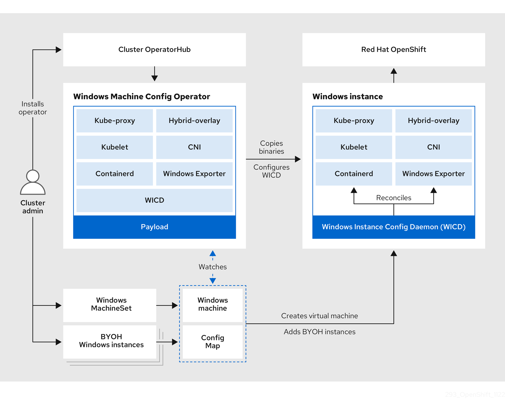
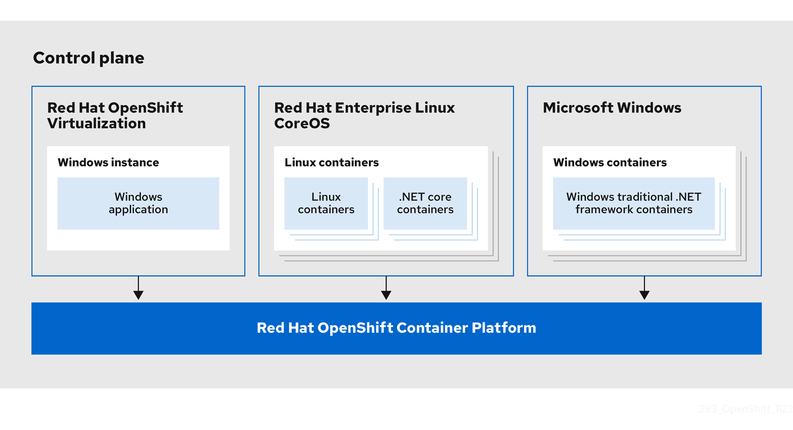

# Understanding Windows container workloads { #understanding-windows-container-workloads }

You can use the Windows Machine Config Operator (WMCO) to run Microsoft Windows Server containers on OpenShift Container Platform. 

For those that administer heterogeneous environments with a mix of Linux and Windows workloads, OpenShift Container Platform allows you to deploy Windows workloads running on Windows Server containers while also providing traditional Linux workloads hosted on Red Hat Enterprise Linux CoreOS (RHCOS) or Red Hat Enterprise Linux (RHEL).

!!! note

    Multi-tenancy for clusters that have Windows nodes is not supported. Clusters are considered *multi-tenant* when multiple workloads operate on shared infrastructure and resources. If one or more workloads running on an infrastructure cannot be trusted, the multi-tenant environment is considered *hostile*.

    Hostile multi-tenant clusters introduce security concerns in all Kubernetes environments. Additional security features, such as pod security policies or more fine-grained role-based access control (RBAC) for nodes, make exploiting your environment more difficult. However, if you choose to run hostile multi-tenant workloads, a hypervisor is the only security option you should use. The security domain for Kubernetes encompasses the entire cluster, not an individual node. For these types of hostile multi-tenant workloads, you should use physically isolated clusters.

    Windows Server Containers provide resource isolation using a shared kernel but are not intended to be used in hostile multitenancy scenarios.

## Windows workload management { #windows-workload-management_understanding-windows-container-workloads }

To run Windows workloads in your cluster, you must install the Windows Machine Config Operator (WMCO). 

The WMCO is a Linux-based Operator that runs on the Linux-based control plane and compute nodes. The WMCO orchestrates the process of deploying and managing Windows workloads on a cluster.

**Figure 1. WMCO design**

Before deploying Windows workloads, you must create a Windows compute node and have it join the cluster. The Windows node hosts the Windows workloads in a cluster, and can run alongside other Linux-based compute nodes. You can create a Windows compute node by creating a Windows compute machine set to host Windows Server compute machines. You must apply a Windows-specific label to the compute machine set that specifies a Windows OS image.

The WMCO watches for machines with the Windows label. After a Windows compute machine set is detected and its respective machines are provisioned, the WMCO configures the underlying Windows virtual machine (VM) so that it can join the cluster as a compute node.

**Figure 2. Mixed Windows and Linux workloads**

The WMCO expects a predetermined secret in its namespace containing a private key that is used to interact with the Windows instance. WMCO checks for this secret during boot up time and creates a user data secret which you must reference in the Windows `MachineSet` object that you created. Then the WMCO populates the user data secret with a public key that corresponds to the private key. With this data in place, the cluster can connect to the Windows VM using an SSH connection.

After the cluster establishes a connection with the Windows VM, you can manage the Windows node using similar practices as you would a Linux-based node.

!!! note

    The OpenShift Container Platform web console provides most of the same monitoring capabilities for Windows nodes that are available for Linux nodes. However, the ability to monitor workload graphs for pods running on Windows nodes is not available at this time.

Scheduling Windows workloads to a Windows node can be done with typical pod scheduling practices, such as taints, tolerations, and node selectors. Alternatively, you can differentiate your Windows workloads from Linux workloads and other Windows-versioned workloads by using a `RuntimeClass` object.

## Windows node services { #windows-node-services_understanding-windows-container-workloads }

By default, the installation process installs several Windows-specific services on each Windows node.

| Service                                                                                                         | Description                                                                                                                                                                                                                        |
| --------------------------------------------------------------------------------------------------------------- | ---------------------------------------------------------------------------------------------------------------------------------------------------------------------------------------------------------------------------------- |
| kubelet                                                                                                         | Registers the Windows node and manages its status.                                                                                                                                                                                 |
| Container Network Interface (CNI) plugins                                                                       | Exposes [networking](https://kubernetes.io/docs/setup/production-environment/windows/intro-windows-in-kubernetes/#networking) for Windows nodes.                                                                                   |
| Windows Instance Config Daemon (WICD)                                                                           | Maintains the state of all services running on the Windows instance to ensure the instance functions as a worker node.                                                                                                             |
| [Windows Exporter](https://github.com/openshift/prometheus-community-windows_exporter)                          | Exports Prometheus metrics from Windows nodes                                                                                                                                                                                      |
| [Kubernetes Cloud Controller Manager (CCM)](https://kubernetes.io/docs/concepts/architecture/cloud-controller/) | Interacts with the underlying Azure cloud platform.                                                                                                                                                                                |
| hybrid-overlay                                                                                                  | Creates the OpenShift Container Platform [Host Network Service (HNS)](https://docs.microsoft.com/en-us/virtualization/windowscontainers/container-networking/architecture#container-network-management-with-host-network-service). |
| kube-proxy                                                                                                      | Maintains network rules on nodes allowing outside communication.                                                                                                                                                                   |
| containerd container runtime                                                                                    | Manages the complete container lifecycle.                                                                                                                                                                                          |
| CSI Proxy                                                                                                       | Enables CSI drivers to perform storage operations on the node, which allows containerized CSI drivers to run on Windows nodes.                                                                                                     |

**Additional resources**

- [Pod Security Policies (Kubernetes Documentation)](https://kubernetes.io/docs/concepts/policy/pod-security-policy/)
- [Configuring hybrid networking with OVN-Kubernetes](../networking/ovn_kubernetes_network_provider/configuring-hybrid-networking.md#configuring-hybrid-ovnkubernetes_configuring-hybrid-networking)
